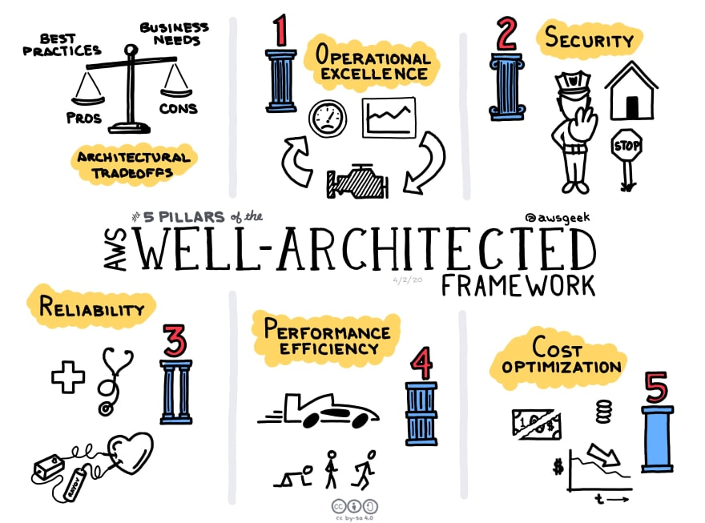

# Software Architect solution

Real time problem in the software architecture 

***Operational Excellence*** - To be able to monitor and support workloads effectively, to enable continuous improvement and to deliver business value.

***Security*** - Improving your security posture by taking advantage of Cloud technologies to protect your assets and systems.

***Reliability*** - Ensuring your workload can perform it's intended function correctly and consistently.

***Performance Efficiency*** - Ensuring appropriate resource allocation to enable performant systems and a positive end user experience.

***Cost Optimisation*** - Ensuring you are delivering business value at the lowest possible cost.

1. [Scheduler in multiple instance](scheduler%20in%20multiple%20instance.md)
